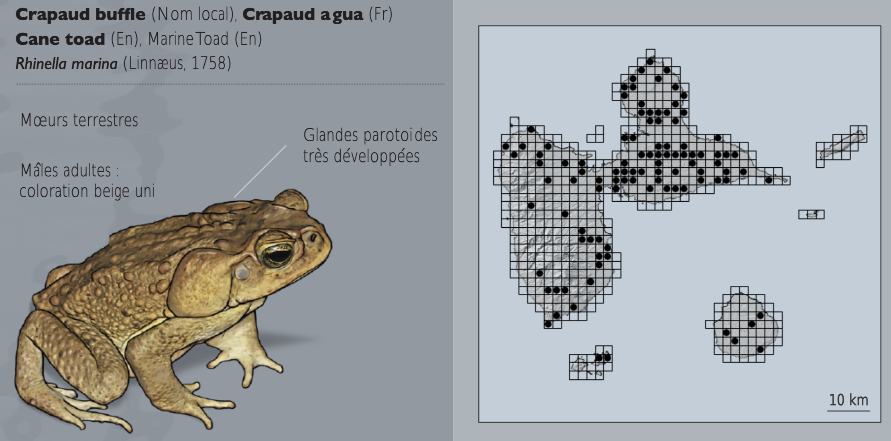

::: {style="display: flex; gap: 20px; align-items: center;"}
{width="180"}
:::

::: {style="text-align: right;"}
Date de dernière mise à jour du document : `r Sys.Date()`
:::

::: {style="background-color: black; padding: 12px; border-radius: 5px; text-align: center; margin-bottom: 20px;"}
<strong style="color: white; font-size: 2em;">
  Élaboration d’un plan d’échantillonnage spatial (GRTS) pour le Crapaud Buffle (*Rhinella marina*) en Guadeloupe <br>
</strong>
:::

::: {style="text-align: justify; font-size: 1.1em; margin-bottom: 20px;"}
Rédigé par <b>Winsback Romain</b> et <b>Roes Julien</b> dans le cadre du module "Stratégies d'échantillonnage et estimation d'abondance des populations " du Master 2 Sciences de l'eau parcours DYNEA (2025-2026) à l'université de Pau et des Pays de l'Adour (campus Montaury). 
:::

<hr style="border:1.5px solid gray">

::: {style="color: black; font-size: 1.2em;"}
## Contexte
:::

<hr style="border:1.5px solid gray">

La mise en place d'un plan d'échantillonnage est une étape cruciale dans la collecte de données écologiques. Elle permet de garantir que les échantillons recueillis sont représentatifs de la population étudiée, tout en optimisant les ressources disponibles. Parmi les différentes méthodes d'échantillonnage, le GRTS (Generalized Random Tessellation Stratified) se distingue par sa capacité à fournir un échantillonnage spatialement équilibré, ce qui est particulièrement utile dans les études environnementales où la distribution spatiale des espèces peut être hétérogène.

Dans ce document nous explorons la mise en place d'un plan d'échantillonnage GRTS pour le suivi du crapaud buffle (*Rhinella marina*) en Guadeloupe. Ce choix est motivé par la nécessité de surveiller cette espèce invasive, qui a des impacts significatifs sur les écosystèmes locaux. En utilisant la base de données Corine Land Cover, nous identifions les types de couverture des sols présents sur l'île, ce qui nous permet de stratifier notre échantillonnage en fonction des habitats majeurs.

::: {style="display: flex; gap: 20px; align-items: center;"}

:::

Étant donné la durée limitée du stage (6 mois), il est essentiel de concevoir un plan d'échantillonnage efficace qui maximise la probabilité de détecter la présence du crapaud buffle dans les différents types d'habitats, tout en minimisant le temps et les ressources nécessaires pour la collecte des données. Le GRTS offre une solution adaptée à ces contraintes, en assurant une couverture spatiale adéquate et en facilitant l'analyse statistique des données recueillies.

::: {style="color: black; font-size: 1.2em;"}
### Chargement et installation des packages
:::


```{r chargement des packages, echo=TRUE, message=FALSE, warnings=FALSE}

pacman::p_load(tidyverse, spsurvey, cartography, readxl, viridisLite, sf, DT, leaflet, ggspatial)

```

::: {style="color: black; font-size: 1.2em;"}
### Téléchargement des données via data.gouv.fr
:::

```{r source des données, echo=TRUE, message=FALSE, warnings=FALSE, eval=FALSE}

download.file('http://www.donnees.statistiques.developpement-durable.gouv.fr/donneesCLC/CLC/region/CLC_D971_UTM_SHP.zip', destfile = 'CLC')
unzip('CLC')

```
<b>

# **I. Importation du .shp et association du type de couverture des sols via la nomenclature**

</b>

<hr style="border:2px solid gray">

::: {style="color: black; font-size: 1.2em;"}
### Définition du répertoire de travail
:::

```{r setup, echo=TRUE, message=FALSE, warning=FALSE, eval=FALSE}

# Si ouverture avec le Rproj il n'y pas besoin de préciser le chemin, sinon : 

Chemin <- "/..../.../..../...." # préciser le chemin dans lequel les données sont hébérgées
setwd(Chemin)

```

::: {style="color: black; font-size: 1.2em;"}
### Chargement des données 
:::

```{r import, echo=TRUE, message=FALSE, warning=FALSE}

# Nomenclature

nomenclature <- readxl::read_excel("CLC_D971_UTM_SHP/CLC_nomenclature.xls", sheet = 4)

# Shapefile de la couverture des sols

# Recensement année 2000
couv2000 <- st_read("CLC_D971_UTM_SHP/CLC00/CLC00_D971_UTM.shp", quiet = TRUE)

# Recensement année 2006
couv2006 <- st_read("CLC_D971_UTM_SHP/CLC06/CLC06_D971_UTM.shp", quiet = TRUE)

# Recensement année 2012
couv2012 <- st_read("CLC_D971_UTM_SHP/CLC12/CLC12_D971_UTM.shp", quiet = TRUE)

```

::: {style="color: black; font-size: 1.2em;"}
### Association des types de sols au shapefile
:::

```{r association colonne type de sol, echo=TRUE, message=FALSE, warning=FALSE}

couv2000 <- left_join(couv2000, nomenclature, by = c("CODE_00" = "code_clc_niveau_4"))
couv2006 <- left_join(couv2006, nomenclature, by = c("CODE_06" = "code_clc_niveau_4"))
couv2012 <- left_join(couv2012, nomenclature, by = c("CODE_12" = "code_clc_niveau_4"))
```

```{r création de la population statistique, echo=FALSE, message=FALSE, include=FALSE, warning=FALSE}

couv2012 <- couv2012 %>%
  group_by(CODE_12, libelle_fr) %>%
  summarise(AREA_HA = sum(AREA_HA, na.rm = TRUE), .groups = "drop") %>%
  filter(AREA_HA >= 500) %>% 
  filter(CODE_12 != "5230")

```

<b>

# **II. Cartographie de la couverture des types de sols en Guadeloupe**

</b>

<hr style="border:2px solid gray">

```{r setup carte, echo=TRUE, message=FALSE, warning=FALSE, include=TRUE}
# CREATION des couleurs correspondants aux types de sols
nomenclature$couleur <- rgb(nomenclature$rouge, nomenclature$vert, nomenclature$bleu, maxColorValue = 255)

# ASSOCIER les couleurs aux types de sols dans couv2012

couv2012 <- left_join(couv2012, nomenclature %>% dplyr::select(libelle_fr, couleur), by = "libelle_fr")

# IMPORT de la carte de la Guadeloupe pour le fond de carte
couvcarte <- st_read("CLC_D971_UTM_SHP/CLC12/CLC12_D971_UTM.shp", quiet = TRUE)

# FILTRER pour ne garder que les terres émergées
couvcarte <- couvcarte %>% filter(CODE_12 != "5230")

# CREATION du vecteur de couleurs pour la légende
couleurs_CLC <- setNames(couv2012$couleur, couv2012$libelle_fr)

# LABEL pour légende
couv2012 <- couv2012 %>%
  mutate(libelle_code = paste0(libelle_fr, " (", CODE_12, ")"))

couleurs_CLC_code <- setNames(couv2012$couleur, couv2012$libelle_code)

```

```{r carte couverture des sols 2012, echo=TRUE, message=FALSE, warning=FALSE, include=TRUE, fig.width=10, fig.height=8}

ggplot() +
  geom_sf(data = couvcarte, fill = "grey95", color = NA) +
  geom_sf(data = couv2012, aes(fill = libelle_code), color = "grey40", linewidth = 0.05) +
  theme_minimal() +
  scale_fill_manual(
    values = couleurs_CLC_code,
    name = "Type de couverture des sols (hors mers et océans (5230) et < 500 ha)") +
  annotation_scale(location = "br", width_hint = 0.3) +
  annotation_north_arrow(
    location = "tl",
    which_north = "true",
    pad_x = unit(0.5, "cm"),
    pad_y = unit(0.5, "cm"),
    style = north_arrow_fancy_orienteering) +
  labs(
    title = "Couverture des sols en Guadeloupe",
    subtitle = "Données Corine Land Cover 2012",
    caption = "Source : data.gouv.fr") +
  theme(
    legend.position = "right",
    legend.key.size = unit(0.6, "cm"),
    legend.text = element_text(size = 8),
    legend.title = element_text(size = 10, face = "bold"),
    plot.title = element_text(face = "bold", size = 14),
    plot.subtitle = element_text(size = 10))

```

<b>

# **III. Création de la population statistique**

</b>

<hr style="border:2px solid gray">

```{r création de la population statistique visible, echo=TRUE, message=FALSE, warning=FALSE}

couv2012 <- couv2012 %>%
  group_by(CODE_12, libelle_fr) %>%
  summarise(AREA_HA = sum(AREA_HA, na.rm = TRUE), .groups = "drop") %>%
  filter(AREA_HA >= 500) %>% 
  filter(CODE_12 != "5230")

```

```{r table de la pop stat, echo=TRUE, message=FALSE, warning=FALSE}

couvtable <- couv2012 %>% 
  dplyr::select(CODE_12, libelle_fr, AREA_HA) %>% st_drop_geometry() %>% mutate(
    AREA_HA = round(AREA_HA, 0), "Type de sol" = libelle_fr) %>% 
  dplyr::select("Type de sol", "Code CLC" = CODE_12, "Surface (ha)" = AREA_HA)

DT::datatable(
  couvtable,
  options = list(
    scrollX = TRUE,
    autoWidth = FALSE,
    pageLength = 13,
    columnDefs = list(list(width = '250px', targets = "_all"))),
  width = "100%",
  height = "auto",
  rownames = FALSE) %>%
formatStyle(
    "Type de sol",
    backgroundColor = styleEqual(names(couleurs_CLC), couleurs_CLC),
    color = "black",
    fontWeight = "bold")
```

<b>

# **IV. Tirage du plan d'échantillonnage (GRTS)**

</b>

<hr style="border:2px solid gray">

```{r}
library(spsurvey)
```

C'est une valeur arbitraire mais on justifie ce nombre par le fait que l'on veut un nombre d'échantillons gérable en 6 mois de stage.

```{r grts, echo=TRUE, message=FALSE, warning=FALSE, eval=FALSE}

n_base <- c("1" = 10, "2" = 10, "3" = 10)

GRTSpts <- grts(
  sframe = couv2012,
  n_base = n_base,
  stratum_var = "code_CLC",
  DesignID = "DM_Rom_Jul")
```


```{r sf, echo=TRUE, message=FALSE, warning=FALSE, eval=FALSE}
GRTS_sf <- st_as_sf(GRTSpts$sites_base, coords = c("X","Y"), crs = st_crs(couv2012))


st_write(GRTS_sf, "tirage_GRTS.shp", delete_dsn = TRUE)

```

```{r csv, echo=TRUE, message=FALSE, warning=FALSE, eval=FALSE}
GRTS_df <- GRTSpts$sites_base
write.csv(GRTS_df, "tirage_GRTS.csv", row.names = FALSE)
```


::: {style="color: black; font-size: 1.2em;"}
## tableau des sites issues du tirage GRTS
:::

```{r import csv, echo=TRUE, message=FALSE, warning=FALSE}

GRTS_df <- read_csv("tirage_GRTS.csv") %>% 
  dplyr::select(lon_WGS84, lat_WGS84, libelle_fr)

GRTS_df <- GRTS_df %>% mutate(
    Identifiant = paste0("site_", row_number())) %>%
  dplyr::select(Identifiant, lon_WGS84, lat_WGS84, libelle_fr) %>% # remise en ordre des colonnes
  rename(Longitude = lon_WGS84,Latitude = lat_WGS84,`Type de sol (code CLC)` = libelle_fr, siteID = Identifiant)

```

```{r couleurs, echo=TRUE, message=FALSE, warning=FALSE, include=FALSE}

# CREATION du vecteur de couleurs PERSONELS
couleurs_PERS <- c(
  "Tissu urbain discontinu" = "#440154CC",
  "Zones industrielles ou commerciales et installations publiques" = "#481F70CC",
  "Canne à sucre" = "#443A83CC",
  "Bananeraies" = "#3B528BCC",
  "Prairies et autres surfaces toujours en herbe à usage agricole" = "#31688ECC",
  "Systèmes culturaux et parcellaires complexes" = "#287C8ECC",
  "Surfaces essentiellement agricoles, interrompues par des espaces naturels importants" = "#21908CCC",
  "Forêts de feuillus" = "#20A486CC",
  "Mangroves" = "#35B779CC",
  "Landes et broussailles" = "#5DC863CC",
  "Végétation sclérophylle" = "#8FD744CC",
  "Forêt et végétation arbustive en mutation" = "#C7E020CC",
  "Marais intérieurs" = "#FDE725CC")
```

```{r tableau, echo=FALSE, message=FALSE, warning=FALSE}

DT::datatable(
  GRTS_df,
  options = list(
    scrollX = TRUE,
    autoWidth = FALSE,
    pageLength = 12,
    columnDefs = list(list(width = '250px', targets = "_all"))),
  width = "100%",
  height = "auto",
  rownames = FALSE) %>%
  formatStyle(
    "Type de sol (code CLC)",
    backgroundColor = styleEqual(names(couleurs_CLC), couleurs_CLC),
    color = "black",
    fontWeight = "bold")

```

<b>

# **V. Cartographie via QGIS**

</b>

<hr style="border:2px solid gray">

::: {style="color: black; font-size: 1.2em;"}
## Limites du plan d'échantillonnage
:::


::: {style="color: black; font-size: 1.2em;"}
## Références bibliographiques
:::

Angin, B., Questel, K., Sculfort, O., Courtois, E. A., Massary, J.-C., Frétey, T., & Dewynter, M. (2024) Les Amphibiens et les Reptiles de la Guadeloupe : identication, répartition et bibliographie. Herp me!, 9: 1–82
