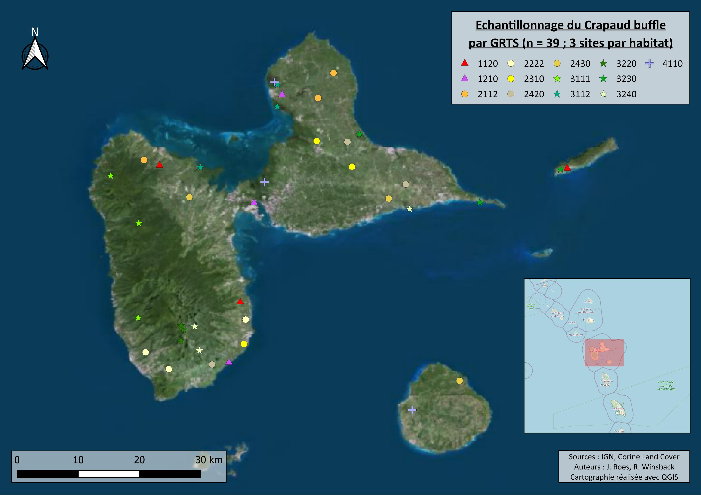

::: {style="display: flex; gap: 20px; align-items: center;"}
{width="180"}
:::

::: {style="text-align: right;"}
Date de dernière mise à jour du document : `r Sys.Date()`   
Ce projet est versionné et hébergé sur Github : https://github.com/Jules74660/DM_ROM_JUL.git"
:::

::: {style="background-color: black; padding: 12px; border-radius: 5px; text-align: center; margin-bottom: 20px;"}
<strong style="color: white; font-size: 2em;">
  Élaboration d’un plan d’échantillonnage spatialement équilibré (GRTS) pour le Crapaud Buffle (*Rhinella marina*) en Guadeloupe <br>
</strong>
:::

::: {style="text-align: justify; font-size: 1.1em; margin-bottom: 20px;"}
Rédigé par <b>Winsback Romain</b> et <b>Roes Julien</b> dans le cadre du module "Stratégies d'échantillonnage et estimation d'abondance des populations " du Master 2 Sciences de l'eau parcours DYNEA (2025-2026) à l'université de Pau et des Pays de l'Adour (campus Montaury). 
:::

<hr style="border:1.5px solid gray">

::: {style="color: black; font-size: 1.2em;"}
## Contexte
:::

<hr style="border:1.5px solid gray">

::: {style="text-align: justify;"}

Lors de l'échantillonnage d'une ressource environnementale, il est important d'appliquer une méthode de sélection probabiliste pour fournir une inférence statistique fiable de l'échantillon à la population (Conn et al. 2016). Cependant, dans de nombreux cas, la ressource environnementale est répartie de manière hétérogène dans l'espace, ce qui peut entraîner une mauvaise couverture spatiale des sites d'échantillonnage. Par conséquent, des méthodes d'échantillonnage spatialement équilibrées ont été développées pour garantir une bonne couverture spatiale des sites d'échantillonnage (Stevens et Olsen 2004).

Parmi les méthodes d'échantillonnage spatialement équilibrées, le Generalized Random Tessellation Stratified (GRTS) est la méthode la plus populaire qui utilise une approche de stratification pour garantir une bonne couverture spatiale des sites d'échantillonnage (Kermorvant et al. 2019). Le GRTS divise l'entité spatiale en une grille ou tessellation de cellules, les cellules sont ensuite regroupées en strates selon un critère (ici le type de sols) ce qui permets de contrôler l'éffort d'échantillonnage par type de strates. Les cellules sont finalement randomisées selon un ordre hiérarchique qui préserve la répartition spatiale, les premiers sites sélectionnés couvrent toute la zone de manière équilibrée et si l'on ajoute des sites supplémentaires, l'équilibre spatial est conservé (Stevens et Olsen 2004).

Dans le cadre d’un stage de six mois visant à mettre en place le suivi d’une espèce terrestre en Guadeloupe, l’utilisation du GRTS permet de maximiser la représentativité des principaux types d’habitats terrestres tout en restant réaliste par rapport à la durée limitée du stage. Pour illustrer ce suivi, nous avons choisi le crapaud buffle (Rhinella marina), une espèce invasive originaire d’Amérique centrale et d’Amérique du Sud, désormais présente en Guadeloupe. 
:::

::: {style="display: flex; gap: 20px; align-items: center;"}

:::

<u> **Figure 1 : *Rhinella marina* (crapaud buffle) (source : Angin et al., 2024)** </u>

::: {style="text-align: justify;"}
Cette espèce peut avoir des impacts significatifs sur les écosystèmes locaux, notamment par la prédation sur les espèces indigènes et la compétition pour les ressources. Son suivi spatial est donc crucial pour comprendre sa répartition et orienter les actions de gestion.

::: {style="color: black; font-size: 1.2em;"}
### Chargement et installation des packages
:::


```{r chargement des packages, echo=TRUE, message=FALSE, warnings=FALSE}

pacman::p_load(tidyverse, spsurvey, cartography, readxl, viridisLite, sf, DT, leaflet, ggspatial)

```

::: {style="color: black; font-size: 1.2em;"}
### Téléchargement des données via data.gouv.fr
:::

```{r source des données, echo=TRUE, message=FALSE, warnings=FALSE, eval=FALSE}

download.file('http://www.donnees.statistiques.developpement-durable.gouv.fr/donneesCLC/CLC/region/CLC_D971_UTM_SHP.zip', destfile = 'CLC')
unzip('CLC')

```

La base de données Corine Land Cover (CLC) fournit une classification détaillée de la couverture du territoire français, y compris la Guadeloupe, et permet d’identifier les principaux types d’habitats terrestres. En combinant le GRTS avec les données CLC, il est possible de stratifier l’échantillonnage par type de sol, garantissant que chaque habitat majeur de l’île soit représenté dans l’étude.

<b>

# **I. Importation du .shp et association du type de couverture des sols via la nomenclature**

</b>

<hr style="border:2px solid gray">

::: {style="color: black; font-size: 1.2em;"}
### Définition du répertoire de travail
:::

```{r setup, echo=TRUE, message=FALSE, warning=FALSE, eval=FALSE}

# Si ouverture avec le Rproj il n'y pas besoin de préciser le chemin, sinon : 

Chemin <- "/..../.../..../...." # préciser le chemin dans lequel les données sont hébérgées
setwd(Chemin)

```

::: {style="color: black; font-size: 1.2em;"}
### Chargement des données 
:::

```{r import, echo=TRUE, message=FALSE, warning=FALSE}

# Nomenclature

nomenclature <- readxl::read_excel("CLC_D971_UTM_SHP/CLC_nomenclature.xls", sheet = 4)

# Shapefiles de la couverture des sols

# Recensement année 2000
couv2000 <- st_read("CLC_D971_UTM_SHP/CLC00/CLC00_D971_UTM.shp", quiet = TRUE)

# Recensement année 2006
couv2006 <- st_read("CLC_D971_UTM_SHP/CLC06/CLC06_D971_UTM.shp", quiet = TRUE)

# Recensement année 2012
couv2012 <- st_read("CLC_D971_UTM_SHP/CLC12/CLC12_D971_UTM.shp", quiet = TRUE)

```

Le jeu de données de 2012 a été privilégié ici pour la création du plan d’échantillonnage, car il constitue la représentation la plus récente de la couverture des sols en Guadeloupe. Les 3 jeux de données ont été importés pour comparer visuellement l'évolution de la répartition des types de sols entre 2000, 2006 et 2012, cependant on observe pas de changement majeur. 

::: {style="color: black; font-size: 1.2em;"}
### Association des types de sols au shapefile
:::

```{r association colonne type de sol, echo=TRUE, message=FALSE, warning=FALSE}

couv2000 <- left_join(couv2000, nomenclature, by = c("CODE_00" = "code_clc_niveau_4"))
couv2006 <- left_join(couv2006, nomenclature, by = c("CODE_06" = "code_clc_niveau_4"))
couv2012 <- left_join(couv2012, nomenclature, by = c("CODE_12" = "code_clc_niveau_4"))
```

```{r création de la population statistique, echo=FALSE, message=FALSE, include=FALSE, warning=FALSE}

couv2012 <- couv2012 %>%
  group_by(CODE_12, libelle_fr) %>%
  summarise(AREA_HA = sum(AREA_HA, na.rm = TRUE), .groups = "drop") %>%
  filter(AREA_HA >= 500) %>% 
  filter(CODE_12 != "5230")

```

<b>

# **II. Cartographie de la couverture des types de sols en Guadeloupe**

</b>

<hr style="border:2px solid gray">

```{r setup carte, echo=TRUE, message=FALSE, warning=FALSE, include=TRUE}
# CREATION des couleurs correspondants aux types de sols
nomenclature$couleur <- rgb(nomenclature$rouge, nomenclature$vert, nomenclature$bleu, maxColorValue = 255)

# ASSOCIER les couleurs aux types de sols dans couv2012

couv2012 <- left_join(couv2012, nomenclature %>% dplyr::select(libelle_fr, couleur), by = "libelle_fr")

# IMPORT de la carte de la Guadeloupe pour le fond de carte
couvcarte <- st_read("CLC_D971_UTM_SHP/CLC12/CLC12_D971_UTM.shp", quiet = TRUE)

# FILTRER pour ne garder que les terres émergées
couvcarte <- couvcarte %>% filter(CODE_12 != "5230")

# CREATION du vecteur de couleurs pour la légende
couleurs_CLC <- setNames(couv2012$couleur, couv2012$libelle_fr)

# LABEL pour légende
couv2012 <- couv2012 %>%
  mutate(libelle_code = paste0(libelle_fr, " (", CODE_12, ")"))

couleurs_CLC_code <- setNames(couv2012$couleur, couv2012$libelle_code)

```

```{r carte couverture des sols 2012, echo=TRUE, message=FALSE, warning=FALSE, include=TRUE, fig.width=10, fig.height=8}

ggplot() +
  geom_sf(data = couvcarte, fill = "grey95", color = NA) +
  geom_sf(data = couv2012, aes(fill = libelle_code), color = "grey40", linewidth = 0.05) +
  theme_minimal() +
  scale_fill_manual(
    values = couleurs_CLC_code,
    name = "Type de couverture des sols (hors mers et océans (5230) et < 500 ha)") +
  annotation_scale(location = "br", width_hint = 0.3) +
  annotation_north_arrow(
    location = "tl",
    which_north = "true",
    pad_x = unit(0.5, "cm"),
    pad_y = unit(0.5, "cm"),
    style = north_arrow_fancy_orienteering) +
  labs(
    title = "Couverture des sols en Guadeloupe",
    subtitle = "Données Corine Land Cover 2012",
    caption = "Source : data.gouv.fr") +
  theme(
    legend.position = "right",
    legend.key.size = unit(0.6, "cm"),
    legend.text = element_text(size = 8),
    legend.title = element_text(size = 10, face = "bold"),
    plot.title = element_text(face = "bold", size = 14),
    plot.subtitle = element_text(size = 10))

```

<b>

# **III. Création de la population statistique**

</b>

<hr style="border:2px solid gray">

```{r création de la population statistique visible, echo=TRUE, message=FALSE, warning=FALSE}

couv2012 <- couv2012 %>%
  group_by(CODE_12, libelle_fr) %>%
  summarise(AREA_HA = sum(AREA_HA, na.rm = TRUE), .groups = "drop") %>%
  filter(AREA_HA >= 500) %>% 
  filter(CODE_12 != "5230")

```

```{r table de la pop stat, echo=TRUE, message=FALSE, warning=FALSE}

couvtable <- couv2012 %>% 
  dplyr::select(CODE_12, libelle_fr, AREA_HA) %>% st_drop_geometry() %>% mutate(
    AREA_HA = round(AREA_HA, 0), "Type de sol" = libelle_fr) %>% 
  dplyr::select("Type de sol", "Code CLC" = CODE_12, "Surface (ha)" = AREA_HA)

DT::datatable(
  couvtable,
  options = list(
    scrollX = TRUE,
    autoWidth = FALSE,
    pageLength = 13,
    columnDefs = list(list(width = '250px', targets = "_all"))),
  width = "100%",
  height = "auto",
  rownames = FALSE) %>%
formatStyle(
    "Type de sol",
    backgroundColor = styleEqual(names(couleurs_CLC), couleurs_CLC),
    color = "black",
    fontWeight = "bold")
```

<b>

# **IV. Tirage du plan d'échantillonnage (GRTS)**

</b>

<hr style="border:2px solid gray">

```{r}
library(spsurvey)
```

On utilise le package « spsurvey » qui contient la fonction permettant d’effectuer un tirage par GRTS.

```{r grts, echo=TRUE, message=FALSE, warning=FALSE, eval=FALSE}

codes <- c("1120","1210","2112","2222","2310","2420","2430",
                  "3111","3112","3220","3230","3240","4110")
```

L’objet « codes » contient les codes correspondant à la nomenclature Corine Land Cover des 13 habitats respectant les critères de sélection évoqués plus tôt (habitat terrestre d’une surface cumulée supérieure à 500 ha). 

```{r grts n, echo=TRUE, message=FALSE, warning=FALSE, eval=FALSE}

n_base <- setNames(rep(3, length(codes)), codes)

GRTSpts <- grts(
  sframe = couv2012,
  n_base = n_base,
  stratum_var = "CODE_12",
  DesignID = "DM_Rom_Jul")
```

La fonction grts() permet de tirer aléatoirement des points par l’intermédiaire de la méthode GRTS, en spécifiant la population statistique (sframe), le nombre de sites à tirer (n_base) et le critère de stratification (stratum_var). Ici, on crée donc un objet « n_base » qui permet de spécifier que l’on souhaite échantillonner 3 sites par habitat, et on stocke l’ensemble des points dans l’objet « GRTSpts ». 

La décision a été prise de tirer **3 points** par habitat pour garantir une bonne représentativité de chaque type de sol, tout en tenant compte des contraintes logistiques et temporelles liées à la durée limitée du stage. Ce choix permet d'obtenir un échantillon suffisamment diversifié pour analyser la présence du crapaud buffle dans différents environnements, tout en restant réaliste quant à la capacité d'échantillonnage sur une période de six mois (**39 points au total**).

```{r pour la carte QGIS, echo=TRUE, message=FALSE, warning=FALSE, eval=FALSE}
st_write(GRTS_sf, "tirage_GRTS.shp", delete_dsn = TRUE)
```

Grâce à la fonction st_as_sf(), on transforme le tableau de points obtenus en objet spatial de type sf manipulable sous R.

```{r sf, echo=TRUE, message=FALSE, warning=FALSE, eval=FALSE}
GRTS_sf <- st_as_sf(GRTSpts$sites_base, coords = c("X","Y"), crs = st_crs(couv2012))


st_write(GRTS_sf, "tirage_GRTS.shp", delete_dsn = TRUE)

```

La fonction st_write() permet de convertir cet objet spatial en un fichier .shp exploitable notamment sous QGIS.

```{r csv, echo=TRUE, message=FALSE, warning=FALSE, eval=FALSE}
GRTS_df <- GRTSpts$sites_base
write.csv(GRTS_df, "tirage_GRTS.csv", row.names = FALSE)
```

On exporte également le tableau du tirage effectué pour manipuler le même tirage GRTS sous R.

::: {style="color: black; font-size: 1.2em;"}
## tableau des sites issues du tirage GRTS
:::

```{r import csv, echo=TRUE, message=FALSE, warning=FALSE}

GRTS_df <- read_csv("tirage_GRTS.csv") %>% 
  dplyr::select(lon_WGS84, lat_WGS84, libelle_fr)

GRTS_df <- GRTS_df %>% mutate(
    Identifiant = paste0("site_", row_number())) %>%
  dplyr::select(Identifiant, lon_WGS84, lat_WGS84, libelle_fr) %>%
  rename(Longitude = lon_WGS84,Latitude = lat_WGS84,`Type de sol (code CLC)` = libelle_fr, siteID = Identifiant)

```

```{r tableau, echo=FALSE, message=FALSE, warning=FALSE}

DT::datatable(
  GRTS_df,
  options = list(
    scrollX = TRUE,
    autoWidth = FALSE,
    pageLength = 12,
    columnDefs = list(list(width = '250px', targets = "_all"))),
  width = "100%",
  height = "auto",
  rownames = FALSE) %>%
  formatStyle(
    "Type de sol (code CLC)",
    backgroundColor = styleEqual(names(couleurs_CLC), couleurs_CLC),
    color = "black",
    fontWeight = "bold")

```

```{r carte grts, echo=TRUE, message=FALSE, warning=FALSE, fig.width=10, fig.height=8}

GRTS_sf <- st_as_sf(GRTS_df, coords = c("Longitude", "Latitude"), crs = 4326)
GRTS_sf <- st_transform(GRTS_sf, st_crs(couv2012))
couv2012 <- couv2012 %>%
  mutate(libelle_code = paste0(libelle_fr, " (", CODE_12, ")"))

ggplot() +
  geom_sf(data = couvcarte, fill = "grey95", color = NA) +
  geom_sf(data = couv2012, aes(fill = libelle_code), color = "grey40", linewidth = 0.05) +
  geom_sf(data = GRTS_sf, color = "white", size = 2, shape = 21, fill = "black") +
  theme_minimal() +
  scale_fill_manual(
    values = couleurs_CLC_code,
    name = "Type de sol (Code CLC ≥ 500 ha, hors mers et océans)") +
  annotation_scale(location = "br", width_hint = 0.3) +
  annotation_north_arrow(
    location = "tl",
    which_north = "true",
    pad_x = unit(0.5, "cm"),
    pad_y = unit(0.5, "cm"),
    style = north_arrow_fancy_orienteering) +
  labs(
    title = "Carte de la couverture des sols en Guadeloupe avec points d’échantillonnage GRTS",
    subtitle = "Données Corine Land Cover 2012 et sites tiré du GRTS",
    caption = "Source : data.gouv.fr") +
  theme(
    legend.position = "right",
    legend.key.size = unit(0.6, "cm"),
    legend.text = element_text(size = 8),
    legend.title = element_text(size = 10, face = "bold"),
    plot.title = element_text(face = "bold", size = 14),
    plot.subtitle = element_text(size = 10))


```

<b>

# **V. Cartographie via QGIS**

</b>

<hr style="border:2px solid gray">

::: {style="display: flex; gap: 20px; align-items: center;"}

:::

::: {style="color: black; font-size: 1.2em;"}
## Limites du plan d'échantillonnage
:::


::: {style="color: black; font-size: 1.2em;"}
## Références bibliographiques
:::

Angin, B., Questel, K., Sculfort, O., Courtois, E. A., Massary, J.-C., Frétey, T., & Dewynter, M. (2024) Les Amphibiens et les Reptiles de la Guadeloupe : identification, répartition et bibliographie.

Conn, P. B., Moreland, E. E., Regehr, E. V., Richmond, E. L., Cameron, M. F., & Boveng, P. L. (2016). Using simulation to evaluate wildlife survey designs: polar bears and seals in the Chukchi Sea. Royal Society Open Science, 3, 150561. https://doi.org/10.1098/rsos.150561.

Don L Stevens Jr. & Anthony R Olsen (2004) Spatially Balanced Sampling of Natural Resources, Journal of the American Statistical Association, 99:465, 262-278. http://dx.doi.org/10.1198/016214504000000250

Kermorvant C, D'Amico F, Bru N, Caill-Milly N, Robertson B. Spatially balanced sampling designs for environmental surveys. Environ Monit Assess. 2019 Jul 30;191(8):524. doi: 10.1007/s10661-019-7666-y. PMID: 31363924.

